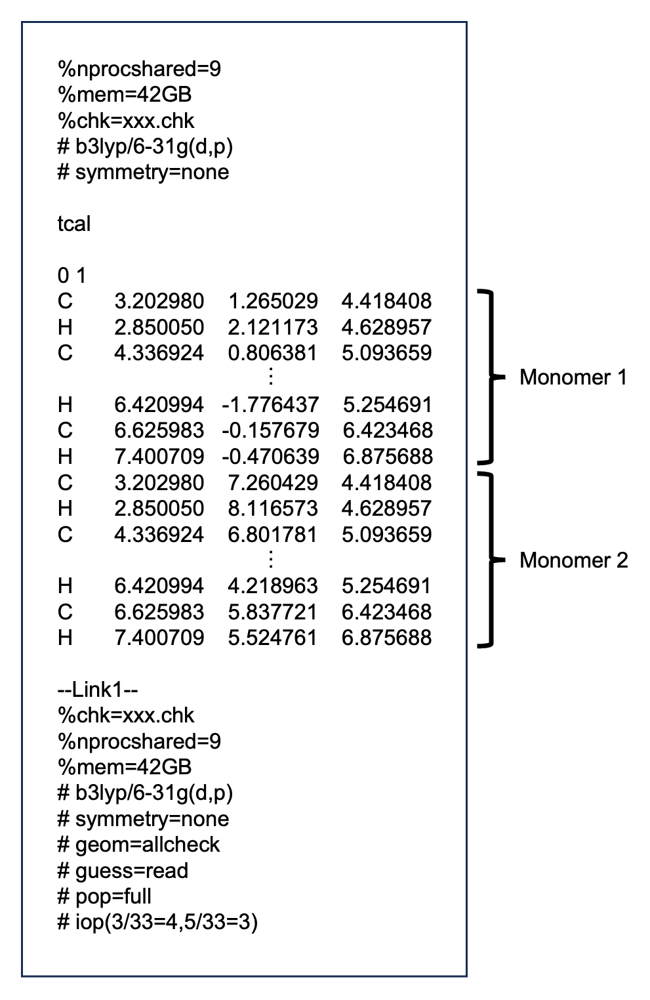
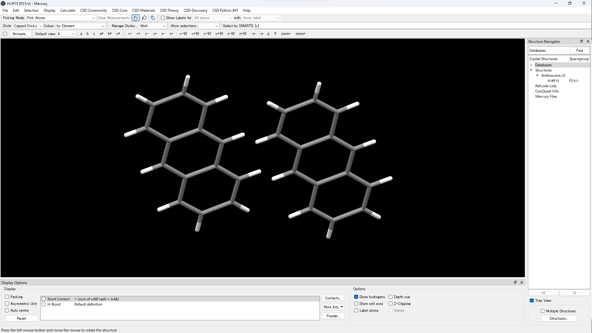
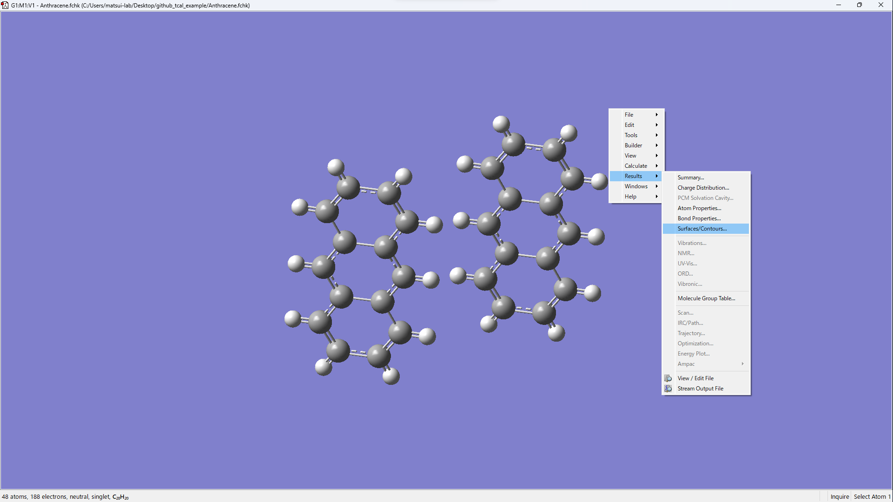
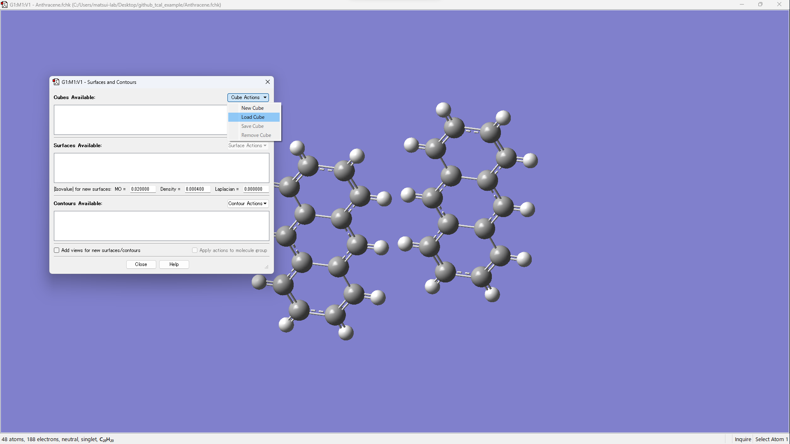
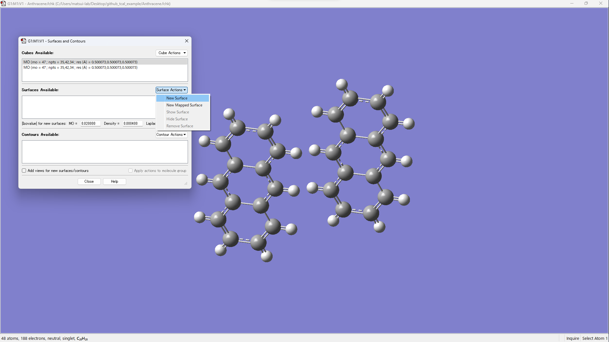
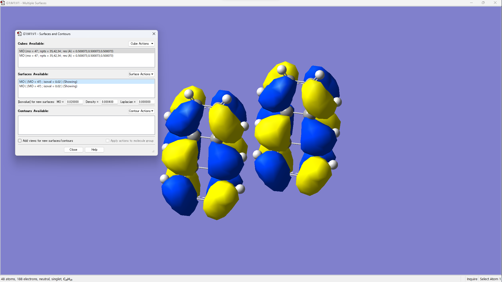

# tcal: Program for the calculation of transfer integral

[](https://www.python.org)
[](https://opensource.org/licenses/MIT)
[](https://matsui-lab-yamagata.github.io/tcal/)

# Requirements
* Python 3.6 or newer
* NumPy
* Gaussian 09 or 16

# Important notice
* The two monomers must be the same molecule.
* The path of the Gaussian must be set.

# Options
|Short|Long|Explanation|
|----|----|----|
|-a|--apta|Perform atomic pair transfer analysis.|
|-c|--cube|Generate cube files.|
|-g|--g09|Use Gaussian 09. (default is Gaussian 16)|
|-h|--help|Show options description.|
|-l|--lumo|Perform atomic pair transfer analysis of LUMO.|
|-m|--matrix|Print MO coefficients, overlap matrix and Fock matrix.|
|-o|--output|Output csv file on the result of apta.|
|-r|--read|Read log files without executing Gaussian.|
|-x|--xyz|Convert xyz file to gjf file.|

# How to use
## 1. Create gjf file
First of all, create a gaussian input file as follows:  
ex: xxx.gjf  
  
The xxx part is an arbitrary string.

### Description of link commands
**pop=full**: Required to output coefficients of basis functions, overlap matrix, and Fock matrix.  
**iop(3/33=4,5/33=3)**: Required to output coefficients of basis functions, overlap matrix, and Fock matrix.  

### How to create a gjf using Mercury
1. Open cif file in Mercury.  
2. Display the dimer you want to calculate.  
  
3. Save in mol file or mol2 file.  
4. Open a mol file or mol2 file in GaussView and save it in gjf format.  


## 2. Execute tcal.py
Suppose the directory structure is as follows.  
```
yyy
├── tcal.py
└── xxx.gjf
```
1. Open a terminal.
2. Go to the directory where the files is located.
```
cd yyy
```
3. Execute the following command.
```python
python tcal.py -a xxx.gjf
```

## 3. Visualization of molecular orbitals
1. Execute the following command.  
```python
python tcal.py -cr xxx.gjf
```
2. Open xxx.fchk in GaussView.  
3. [Results] &rarr; [Surfaces/Contours...]  
  
4. [Cube Actions] &rarr; [Load Cube]  
5. Open xxx_m1_HOMO.cube and xxx_m2_HOMO.cube.  
  
6. Visualize by operating [Surface Actions] &rarr; [New Surface].  
  
  


# Interatomic transfer integral
For calculating the transfer integral between molecule A and molecule B, DFT calculations were performed for monomer A, monomer B, and the dimer AB. The monomer molecular orbitals $\ket{A}$ and $\ket{B}$ were obtained from the monomer calculations. Fock matrix F and overlap matrix S were calculated in the dimer system. Finally the intermolecular transfer integral $t^{[1]}$ was calculated by using the following equation:

$$t = \frac{\braket{A|F|B} - \frac{1}{2} (\epsilon_{A}+\epsilon_{B})\braket{A|S|B}}{1 - \braket{A|S|B}^2},$$

where $\epsilon_A \equiv \braket{A|F|A}$ and $\epsilon_B \equiv \braket{B|F|B}$.  

In addition to the intermolecular transfer integral in general use, we developed an interatomic transfer integral for further analysis $^{[2]}$. By grouping the basis functions $\ket{i}$ and $\ket{j}$ for each atom, the molecular orbitals can be expressed as

$$\ket{A} = \sum^A_{\alpha} \sum^{\alpha}_i a_i \ket{i},$$ 

$$\ket{B} = \sum^B_{\beta} \sum^{\beta}_j b_j \ket{j},$$

where $\alpha$ and $\beta$ are the indices of atoms, $i$ and $j$ are indices of basis functions, and $a_i$ and $b_j$ are the coefficients of basis functions. Substituting this formula into aforementioned equation gives

$$t = \sum^A_{\alpha} \sum^B_{\beta} \sum^{\alpha}_i \sum^{\beta}_j a^*_i b_j \frac{\braket{i|F|j} - \frac{1}{2} (\epsilon_A + \epsilon_B) \braket{i|S|j}}{1 - \braket{A|S|B}^2}$$

Here we define the interatomic transfer integral $u_{\alpha\beta}$ as:

$$u_{\alpha \beta} \equiv \sum^{\alpha}_i \sum^{\beta}_j a^*_i b_j \frac{\braket{i|F|j} - \frac{1}{2} (\epsilon_A + \epsilon_B) \braket{i|S|j}}{1 - \braket{A|S|B}^2}$$


# References
[1] Veaceslav Coropceanu *et al.*, Charge Transport in Organic Semiconductors, *Chem. Rev.* **2007**, *107*, 926-952.  
[2] Satoru Inoue *et al.*, Regioisomeric control of layered crystallinity in solution-processable organic semiconductors, *Chem. Sci.* **2020**, *11*, 12493-12505.  

# Example of using tcal
1. [Satoru Inoue *et al.*, Regioisomeric control of layered crystallinity in solution-processable organic semiconductors, *Chem. Sci.* **2020**, *11*, 12493-12505.](https://pubs.rsc.org/en/content/articlelanding/2020/SC/D0SC04461J)  
2. [Toshiki Higashino *et al.*, Architecting Layered Crystalline Organic Semiconductors Based on Unsymmetric π-Extended Thienoacenes, *Chem. Mater.* **2021**, *33*, 18, 7379–7385.](https://pubs.acs.org/doi/10.1021/acs.chemmater.1c01972)  

# Authors
[Matsui Laboratory, Research Center for Organic Electronics (ROEL), Yamagata University](https://matsui-lab.yz.yamagata-u.ac.jp/index-e.html)  
Hiroyuki Matsui, Koki Ozawa  
Email: h-matsui[at]yz.yamagata-u.ac.jp  
Please replace [at] with @  

# Acknowledgements
This work was supported by JST, CREST, Grand Number JPMJCR18J2.
