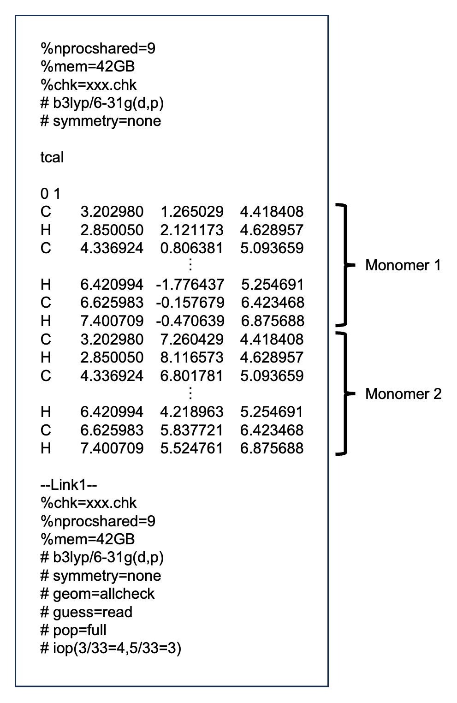
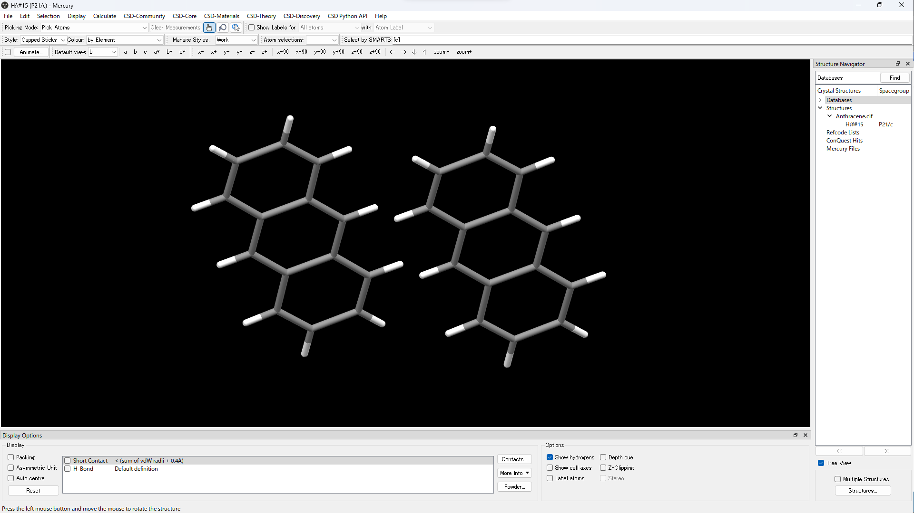
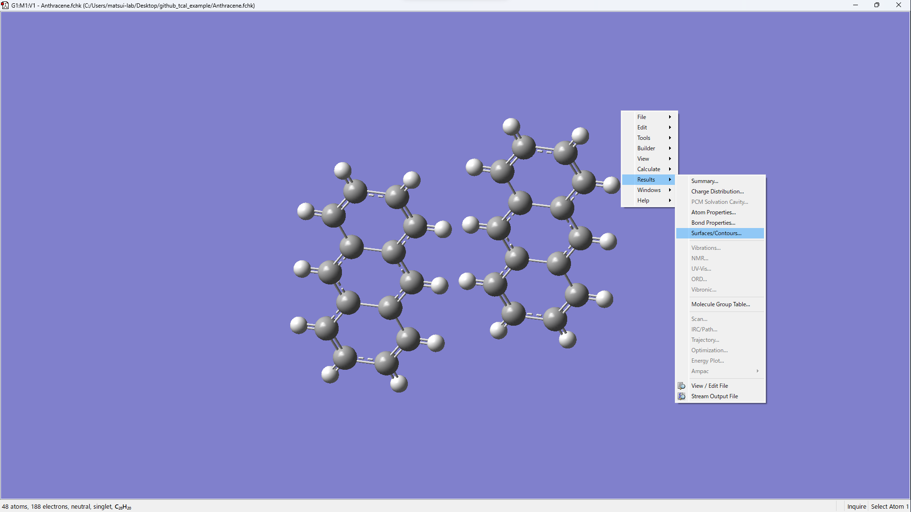
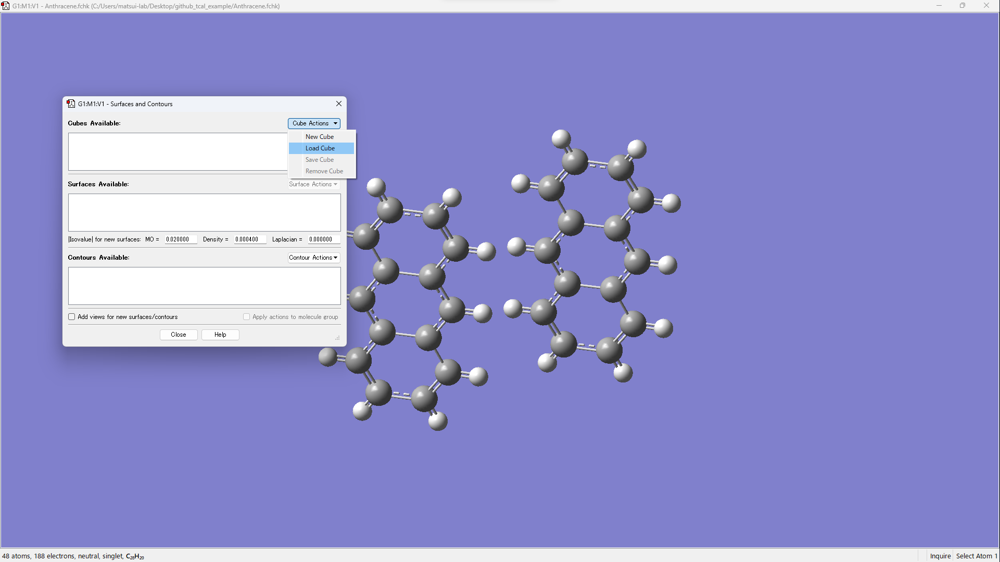
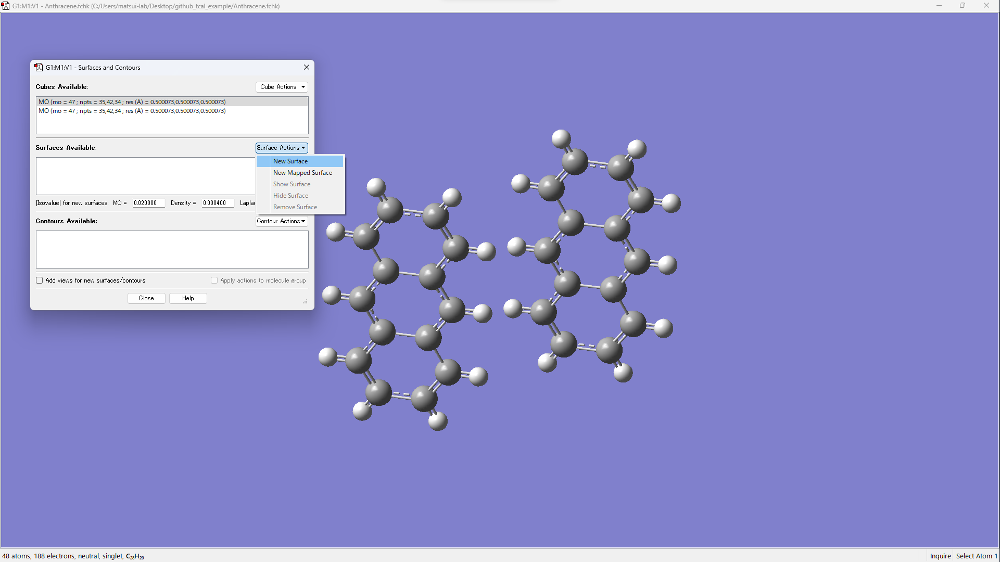
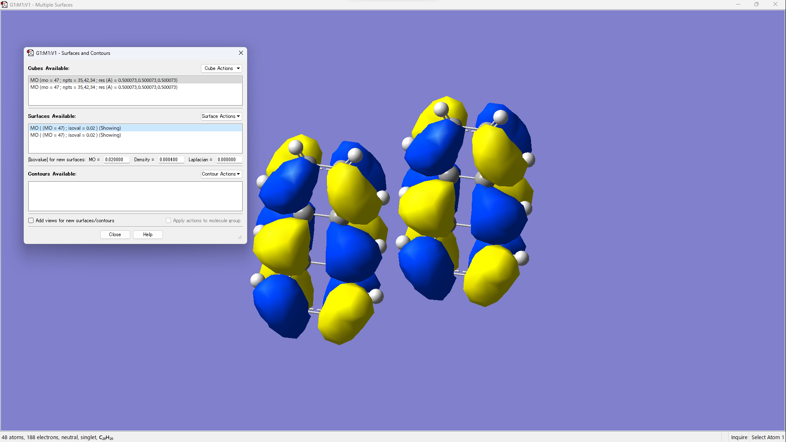

# tcal: 移動積分計算プログラム
[](https://www.python.org)
[](https://opensource.org/licenses/MIT)
[](https://pypi.org/project/yu-tcal/)
[](https://matsui-lab-yamagata.github.io/tcal/)

# 動作要件
* Python 3.11 以上
* NumPy
* Gaussian 09 または 16（オプション）
* PySCF（オプション、macOS / Linux / WSL2 (Windows Subsystem for Linux)）
* ORCA 6.1.0 以上（オプション）

# 重要事項
* Gaussian を使用する場合は、Gaussian のパスを設定してください。
* PySCF は macOS および Linux でサポートされています。Windows ユーザーは WSL2 を使用してください。
* ORCA を使用する場合は、ORCA がインストールされている必要があります。ORCA で並列計算を行うには、OpenMPI の設定が必要です。

# インストール
## Gaussian 09 または 16 を使用する場合（PySCF なし）
```
pip install yu-tcal
```

## PySCF を使用する場合（CPU のみ、macOS / Linux / WSL2）
```
pip install "yu-tcal[pyscf]"
```

## PySCF で GPU アクセラレーションを使用する場合（macOS / Linux / WSL2）
### 1. インストール済みの CUDA Toolkit バージョンを確認する
```
nvcc --version
```

### 2. GPU アクセラレーション付きで tcal をインストールする
CUDA Toolkit バージョンが 13.x の場合:
```
pip install "yu-tcal[gpu4pyscf-cuda13]"
```
CUDA Toolkit バージョンが 12.x の場合:
```
pip install "yu-tcal[gpu4pyscf-cuda12]"
```
CUDA Toolkit バージョンが 11.x の場合:
```
pip install "yu-tcal[gpu4pyscf-cuda11]"
```

## ORCA を使用する場合
```
pip install "yu-tcal[orca]"
```

## インストールの確認
インストール後、以下のコマンドで動作確認できます:
```
tcal --help
```

# オプション
|短縮形|長形式|説明|
|----|----|----|
|-a|--apta|原子ペア移動解析を実行する。|
|-c|--cube|cube ファイルを生成する。|
|-g|--g09|Gaussian 09 を使用する（デフォルトは Gaussian 16）。|
|-h|--help|オプションの説明を表示する。|
|-l|--lumo|LUMO の原子ペア移動解析を実行する。|
|-m|--matrix|MO 係数、重なり行列、Fock 行列を出力する。|
|-o|--output|apta の結果を csv ファイルに出力する。|
|-r|--read|計算を実行せず、log/チェックポイントファイルを読み込む。|
|-x|--xyz|xyz ファイルを gjf ファイルに変換する（Gaussian のみ）。|
|-M|--method METHOD/BASIS|"METHOD/BASIS" 形式で計算手法と基底関数系を指定する（デフォルト: B3LYP/6-31G(d,p)）。|
||--cpu N|CPU 数を設定する（デフォルト: 4）。|
||--mem N|メモリサイズを GB 単位で設定する（デフォルト: 16）。|
||--napta N1 N2|異なるレベル間の原子ペア移動解析を実行する。N1 は第一単量体のレベル数、N2 は第二単量体のレベル数。|
||--hetero N|ヘテロダイマーの移動積分を計算する。N は第一単量体の原子数。|
||--nlevel N|異なるレベル間の移動積分を計算する。N は HOMO-LUMO からのレベル数。N=0 で全レベルを計算。|
||--skip N...|指定した計算をスキップする。N=1 で第一単量体計算をスキップ、N=2 で第二単量体計算をスキップ、N=3 でダイマー計算をスキップ。|
||--pyscf|Gaussian の代わりに PySCF を使用する。入力ファイルは xyz ファイル。|
||--gpu4pyscf|gpu4pyscf による GPU アクセラレーションを使用する（PySCF のみ）。|
||--bse|Basis Set Exchange を使用して基底関数系を取得する。PySCF に含まれない基底関数系の使用が可能（PySCF のみ）。|
||--mpi PATH|ORCA 並列実行のための OpenMPI インストールディレクトリへのパス（`OPI_MPI` 環境変数を設定）（ORCA のみ）。|

# 使い方
## Gaussian を使用する場合
### 1. gjf ファイルの作成
まず、以下のように Gaussian 入力ファイルを作成します:  
例: xxx.gjf  
  
xxx の部分は任意の文字列です。

#### リンクコマンドの説明
**pop=full**: 基底関数の係数、重なり行列、Fock 行列を出力するために必要。  
**iop(3/33=4,5/33=3)**: 基底関数の係数、重なり行列、Fock 行列を出力するために必要。  

#### Mercury を使った gjf ファイルの作成方法
1. Mercury で cif ファイルを開く。  
2. 計算したいダイマーを表示する。  
  
3. mol ファイルまたは mol2 ファイルとして保存する。  
4. GaussView で mol ファイルまたは mol2 ファイルを開き、gjf 形式で保存する。  

### 2. tcal の実行
ディレクトリ構成が以下のようになっているとします。  
```
yyy
└── xxx.gjf
```
1. ターミナルを開く。
2. ファイルのあるディレクトリに移動する。
```
cd yyy
```
3. 以下のコマンドを実行する。
```
tcal -a xxx.gjf
```

### 3. 分子軌道の可視化
1. 以下のコマンドを実行する。
```
tcal -cr xxx.gjf
```
2. GaussView で xxx.fchk を開く。
3. [Results] &rarr; [Surfaces/Contours...]
  
4. [Cube Actions] &rarr; [Load Cube]
5. xxx_m1_HOMO.cube と xxx_m2_HOMO.cube を開く。
  
6. [Surface Actions] &rarr; [New Surface] を操作して可視化する。
  
  

## PySCF を使用する場合
### 1. xyz ファイルの作成
ダイマー構造の xyz ファイルを用意します。  
前半の原子が単量体 1、後半の原子が単量体 2 として扱われます。  
ヘテロダイマーの場合は、`--hetero N` オプションで第一単量体の原子数を指定してください。

### 2. tcal の実行
```
tcal --pyscf -a xxx.xyz
```
計算手法と基底関数系を指定する場合:
```
tcal --pyscf -M "B3LYP/6-31G(d,p)" -a xxx.xyz
```
GPU アクセラレーションを使用する場合:
```
tcal --gpu4pyscf -M "B3LYP/6-31G(d,p)" -a xxx.xyz
```
Basis Set Exchange の基底関数系を使用する場合（例: def2-TZVP, cc-pVDZ）:
```
tcal --pyscf --bse -M "B3LYP/def2-TZVP" -a xxx.xyz
```
計算を再実行せずに既存のチェックポイントファイルから読み込む場合:
```
tcal --pyscf -ar xxx.xyz
```

## ORCA を使用する場合
### 1. xyz ファイルの作成
ダイマー構造の xyz ファイルを用意します。  
前半の原子が単量体 1、後半の原子が単量体 2 として扱われます。  
ヘテロダイマーの場合は、`--hetero N` オプションで第一単量体の原子数を指定してください。

### 2. tcal の実行
```
tcal --orca -a xxx.xyz
```
計算手法と基底関数系を指定する場合:
```
tcal --orca -M "B3LYP/6-31G(d,p)" -a xxx.xyz
```
計算を再実行せずに既存の出力ファイルから読み込む場合:
```
tcal --orca -ar xxx.xyz
```

### 並列実行
複数の CPU コアを使用する場合（`--cpu N`）、OpenMPI がインストールされている必要があります。  
まず、`mpirun` が利用可能か確認します:
```bash
which mpirun
```
Linux/WSL で `apt install` 後など、OpenMPI がすでに `$PATH` と `$LD_LIBRARY_PATH` に設定されている場合は、追加の設定は不要です。

並列実行がうまくいかない場合は、OpenMPI のベースディレクトリ（`bin/` と `lib/` を含むディレクトリ）を見つけ、`OPI_MPI` または `--mpi` で指定してください。

#### Linux / WSL
> **注意:** ORCA は特定バージョンの OpenMPI を必要とします。`apt` で入手できるバージョンが一致しない場合があります。並列実行が失敗する場合は、[ORCA ドキュメント](https://www.faccts.de/docs/orca/6.0/manual/)に記載されているバージョンの OpenMPI をソースからビルドすることをお勧めします。

専用ディレクトリにインストールされている場合（例: ソースからビルド、モジュールシステム経由）:
```bash
which mpirun
# 例: /opt/openmpi/bin/mpirun  →  ベース: /opt/openmpi
export OPI_MPI=$(dirname $(dirname $(which mpirun)))
```
`apt`（Ubuntu/Debian）経由でシステム全体にインストールされている場合、`mpirun` は通常 `/usr/bin/mpirun` にありますが、OpenMPI ライブラリは `/usr/lib/` 下にあります。以下で確認してください:
```bash
which mpirun
# /usr/bin/mpirun  →  ベースは通常 /usr/lib/x86_64-linux-gnu/openmpi
export OPI_MPI=/usr/lib/x86_64-linux-gnu/openmpi
```

#### macOS (Homebrew)
```bash
which mpirun
# 例: /opt/homebrew/bin/mpirun
export OPI_MPI=$(brew --prefix open-mpi)
```

#### `--mpi` でパスを渡す場合
環境変数を設定する代わりに、パスを直接渡すこともできます:
```bash
tcal --orca --cpu 8 --mpi /path/to/openmpi -a xxx.xyz
```

# 原子間移動積分
分子 A と分子 B の間の移動積分を計算するために、単量体 A、単量体 B、およびダイマー AB に対して DFT 計算を実施します。単量体の分子軌道 $\ket{A}$ と $\ket{B}$ は単量体計算から得られます。Fock 行列 F はダイマー系で計算されます。最終的に、分子間移動積分 $t^{[1]}$ を以下の式で計算します:

$$t = \frac{\braket{A|F|B} - \frac{1}{2} (\epsilon_{A}+\epsilon_{B})\braket{A|B}}{1 - \braket{A|B}^2},$$

ここで $\epsilon_A \equiv \braket{A|F|A}$、$\epsilon_B \equiv \braket{B|F|B}$ です。

一般的に使用される分子間移動積分に加え、さらなる解析のための原子間移動積分を開発しました $^{[2]}$。各原子の基底関数 $\ket{i}$ と $\ket{j}$ をグループ化することで、分子軌道を以下のように表すことができます:

$$\ket{A} = \sum^A_{\alpha} \sum^{\alpha}_i a_i \ket{i},$$

$$\ket{B} = \sum^B_{\beta} \sum^{\beta}_j b_j \ket{j},$$

ここで $\alpha$ と $\beta$ は原子のインデックス、$i$ と $j$ は基底関数のインデックス、$a_i$ と $b_j$ は基底関数の係数です。この式を前述の方程式に代入すると:

$$t = \sum^A_{\alpha} \sum^B_{\beta} \sum^{\alpha}_i \sum^{\beta}_j a^*_i b_j \frac{\braket{i|F|j} - \frac{1}{2} (\epsilon_A + \epsilon_B) \braket{i|j}}{1 - \braket{A|B}^2}$$

ここで原子間移動積分 $u_{\alpha\beta}$ を次のように定義します:

$$u_{\alpha \beta} \equiv \sum^{\alpha}_i \sum^{\beta}_j a^*_i b_j \frac{\braket{i|F|j} - \frac{1}{2} (\epsilon_A + \epsilon_B) \braket{i|j}}{1 - \braket{A|B}^2}$$

# 参考文献
[1] Veaceslav Coropceanu et al., Charge Transport in Organic Semiconductors, *Chem. Rev.* **2007**, *107*, 926-952.  
[2] Koki Ozawa et al., Statistical analysis of interatomic transfer integrals for exploring high-mobility organic semiconductors, *Sci. Technol. Adv. Mater.* **2024**, *25*, 2354652.  
[3] Qiming Sun et al., Recent developments in the PySCF program package, *J. Chem. Phys.* **2020**, *153*, 024109.  
[4] Benjamin P. Pritchard et al., New Basis Set Exchange: An Open, Up-to-Date Resource for the Molecular Sciences Community, *J. Chem. Inf. Model.* **2019**, *59*, 4814-4820.  
[5] Frank Neese, The ORCA program system, *Wiley Interdiscip. Rev. Comput. Mol. Sci.*, **2012**, *2*, 73-78.  

# 引用
tcal を利用した研究を発表する際は、以下の論文を引用してください。  
Koki Ozawa, Tomoharu Okada, Hiroyuki Matsui, Statistical analysis of interatomic transfer integrals for exploring high-mobility organic semiconductors, *Sci. Technol. Adv. Mater.*, **2024**, *25*, 2354652.  
[DOI: 10.1080/14686996.2024.2354652](https://doi.org/10.1080/14686996.2024.2354652)  

# tcal の使用例
1. [Satoru Inoue et al., Regioisomeric control of layered crystallinity in solution-processable organic semiconductors, *Chem. Sci.* **2020**, *11*, 12493-12505.](https://pubs.rsc.org/en/content/articlelanding/2020/SC/D0SC04461J)  
2. [Toshiki Higashino et al., Architecting Layered Crystalline Organic Semiconductors Based on Unsymmetric π-Extended Thienoacenes, *Chem. Mater.* **2021**, *33*, 18, 7379–7385.](https://pubs.acs.org/doi/10.1021/acs.chemmater.1c01972)  
3. [Koki Ozawa et al., Statistical analysis of interatomic transfer integrals for exploring high-mobility organic semiconductors, *Sci. Technol. Adv. Mater.* **2024**, *25*, 2354652.](https://doi.org/10.1080/14686996.2024.2354652)  

# 著者
[山形大学有機エレクトロニクス研究センター (ROEL) 松井研究室](https://matsui-lab.yz.yamagata-u.ac.jp/index.html)  
松井 弘之、尾沢 昂輝  
メール: h-matsui[at]yz.yamagata-u.ac.jp  
[at] を @ に置き換えてください。  

# 謝辞
本研究は JST、CREST、課題番号 JPMJCR18J2 の支援を受けました。  
